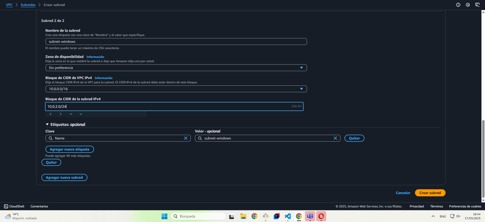
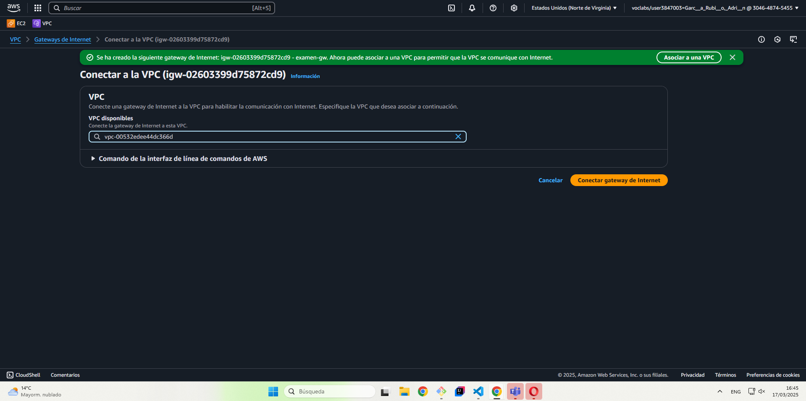
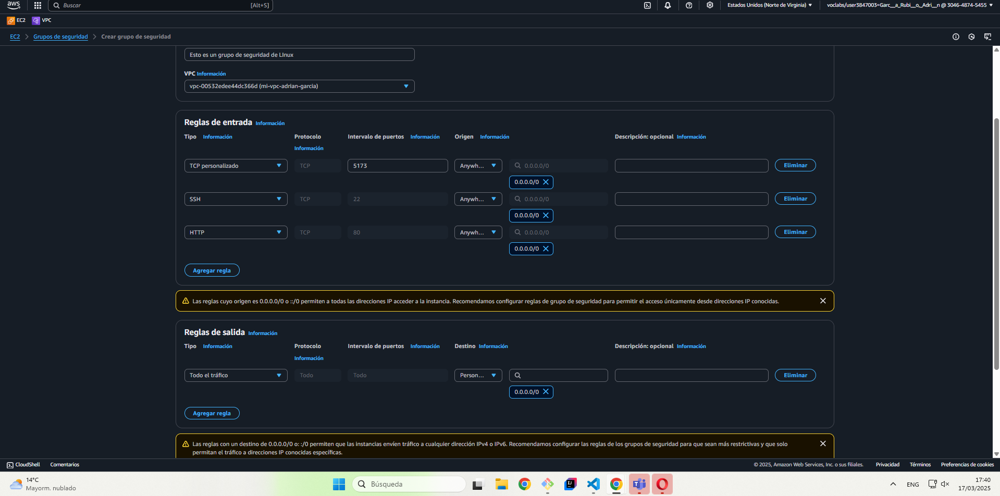
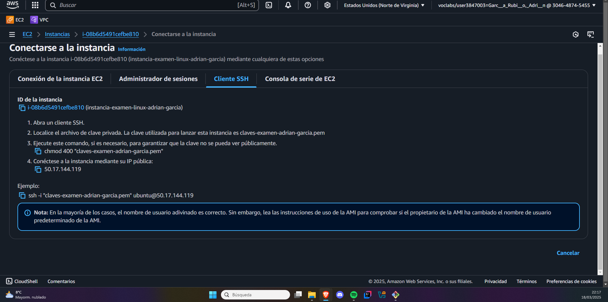
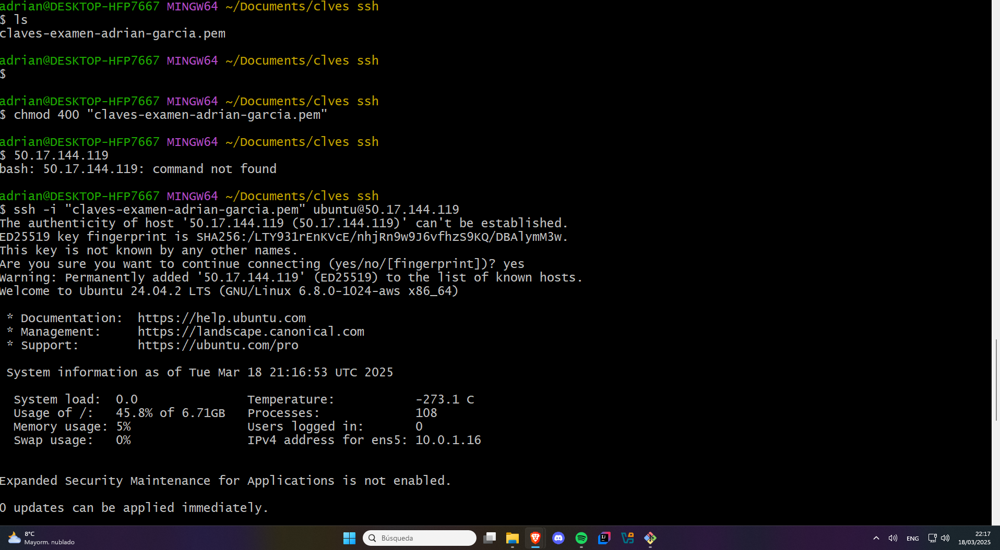
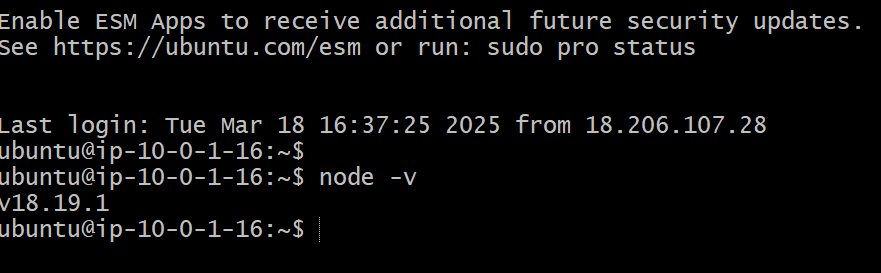
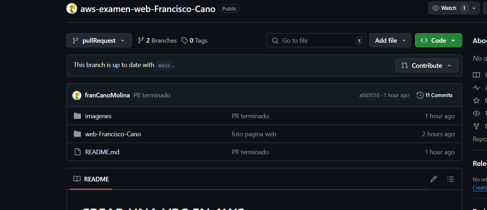
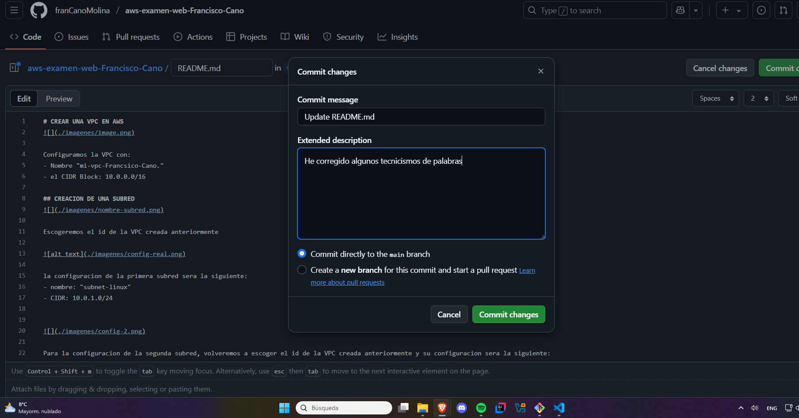
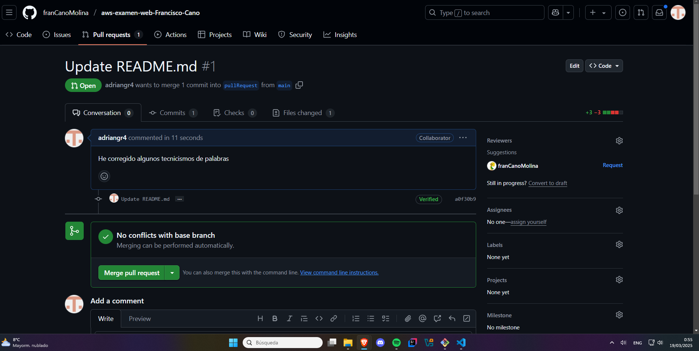

# Examen AWS: Creación de una VPC con Máquinas Virtuales y Despliegue Web

##  1. Creación de la VPC en AWS  
1. **Crear una VPC** con el nombre `mi-vpc-TuNombre-Apellidos` y el bloque CIDR `10.0.0.0/16`.  
2. **Crear dos subredes** dentro de la VPC:  
   - `subnet-linux` con CIDR `10.0.1.0/24`.  
   - `subnet-windows` con CIDR `10.0.2.0/24`.  
3. **Crear y asociar una Internet Gateway** a la VPC.  
4. **Configurar la tabla de rutas** para permitir el acceso a Internet (`0.0.0.0/0`).  






##  2. Creación de Instancias EC2  
### **Instancia Windows**  
1. **Seleccionar Windows Server 2022** y ubicarlo en `subnet-windows`.  
2. **Configurar como tipo de instancia** `t3.medium`.  
3. **Asignar un Security Group** con las siguientes reglas:  
   - HTTP (80) desde `0.0.0.0/0`.  
   - Vite (5173) desde `0.0.0.0/0`.  
   - RDP (3389) solo desde tu IP pública.  


### **Instancia Linux (Ubuntu)**  
1. **Seleccionar Ubuntu 22.04** y ubicarlo en `subnet-linux`.  
2. **Asignar una IP pública** para acceder mediante SSH.  
3. **Configurar un Security Group** con:  
   - HTTP (80) desde `0.0.0.0/0`.  
   - Vite (5173) desde `0.0.0.0/0`.  
   - SSH (22) solo desde tu IP pública.  





##  3. Instalación y Despliegue Web  

### **Instalación en Linux (Ubuntu SSH)**  
```bash
sudo apt update 
sudo apt install nodejs npm -y 
sudo npm install -g vite serve 
mkdir web-tunombre-apellidos && cd web-tunombre-apellidos 
npm init vite@latest . 
npm install 
npm run build 
serve -s dist -l 5173 
```





- Si hubiera podido tener varias pestañas en la terminal, habria hecho un ping a localHost para comprobar que la web da internet pero no me ha sido posible


##  5. Documentación en GitHub  
1. **Crear un repositorio en GitHub** llamado `aws-examen-web-nombre-apellidos`.   
2. **Realizar un Pull Request** al repositorio de un compañero con una revisión constructiva.  



